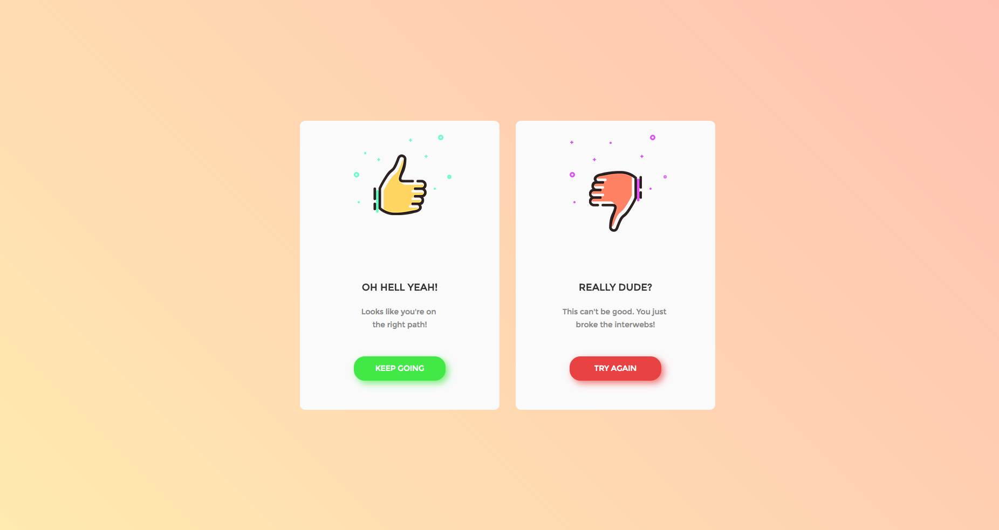

# flash-message
> daily-ui 011-flash-message

<p align="center">
  <a href="http://flash-message.raincal.top">
    
    <br />
    Live Demo
  </a>
</p>

## Development

```shell
npm i cooking -g
npm run dev
```

## Production
```
npm run dist
```

## License
ISC
